# 🏥 Medical Appointment Booking System

> **Backend Documentation & Architecture Guide**

---

## 📖 Overview
Welcome to the **Medical Appointment Booking System**! This robust Spring Boot application facilitates seamless interactions between Patients and Doctors. It handles the entire lifecycle from user registration and doctor profiling to appointment booking and secure payments via Razorpay.

---

## 🏗️ System Architecture

The application is built on a clean **Controller-Service-Repository** layered architecture, ensuring separation of concerns and scalability.

```mermaid
graph TD
    Client[📱 Client / Postman] -->|HTTP Requests| Controller[🎮 Controller Layer]
    Controller -->|DTOs| Service[⚙️ Service Layer]
    Service -->|Entities| Repository[💾 Repository Layer]
    Repository -->|SQL| DB[(🗄️ PostgreSQL)]
    Service -.->|API Call| Razorpay[💳 Razorpay Gateway]
    
    style Client fill:#f9f,stroke:#333
    style Controller fill:#bbf,stroke:#333
    style Service fill:#bfb,stroke:#333
    style Repository fill:#fbf,stroke:#333
    style DB fill:#ff9,stroke:#333
```

### 🧱 Core Layers

<b>1. Presentation Layer (Controllers)</b>

 
Handles incoming API requests, validates inputs using DTOs, and orchestrates the response.
<ul>
    <li><code>UserController</code>: Manage accounts.</li>
    <li><code>DoctorController</code>: Manage profiles.</li>
    <li><code>AppointmentController</code>: Booking & Slots.</li>
    <li><code>PaymentController</code>: Razorpay integration.</li>
</ul>

<b>2. Business Logic Layer (Services)</b>

 
Contains the meat of the application. Handles transactions, validation, and integration logic.
<ul>
    <li><code>UserService</code></li>
    <li><code>DoctorService</code></li>
    <li><code>AppointmentService</code></li>
    <li><code>PaymentService</code></li>
</ul>

<b>3. Data Access Layer (Repositories)</b>

 
Interfaces with PostgreSQL using Spring Data JPA.

---

## 🔄 Key Workflows

### 1️⃣ End-to-End User Journey
The following flowchart illustrates the complete user journey from registration to paying for an appointment:

#### Step-by-Step Flow:
1.  **User Registration**:
    *   A user signs up as a **Patient** or **Doctor** using `/api/users`.
    *   If a **Doctor**, they create a professional profile via `/api/doctors`.
2.  **Slot Creation**:
    *   Doctors define their availability using `/api/appointments/slots`.
3.  **Discovery & Booking**:
    *   Patients view doctors list.
    *   Patient selects a doctor and an available slot.
    *   Calls `/api/appointments/book` to reserve the slot.
4.  **Payment Processing**:
    *   Patient initiates payment for the appointment.
    *   Backend communicates with Razorpay to create an order.
    *   After successful payment on the client side, the backend verifies the secure signature.
    *   The appointment is finalized and marked as confirmed/paid.

### 2️⃣ Payment Integration
We use **Razorpay** for secure, PCI-compliant payments.
*   **No sensitive data status**: Card numbers are never stored on our server.
*   **Verification**: All payments are cryptographically verified using signatures.
*   **Demo**: Visit `http://localhost:8080/index.html` to try it out!

---

## 🛠️ Technology Stack

| Category | Technology |
| :--- | :--- |
| **Framework** |  |
| **Language** |  |
| **Database** |  |
| **Build Tool** |  |
| **Payments** |  |
